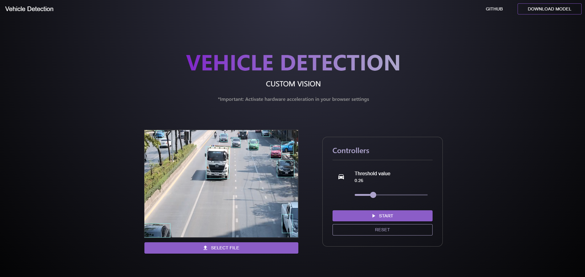

# Vehicle Detection in Video Project using Custom Vision

This project utilizes React along with Custom Vision for vehicle detection in videos. A vehicle detection model has been trained and exported from Custom Vision, which is integrated into the application.

**Important: Activate hardware acceleration in your browser settings**

## Screenshots

Below are some screenshots of the application in action:

You can adjust the threshold value to adjust the values of the probability of vehicle detection, the higher the value, the lower the number of vehicles detected.

## Model

The trained model is located at:

~~~
`public/` 
  |-- `model.json`
  |-- `weights.bin.`
~~~

## Running the Project
To run the project, follow these steps:

1. Make sure you have `Node.js` and npm installed on your system.
2. Install the project dependencies by running `npm install`.
3. Once the dependencies are installed, you can start the application with `npm start`.
4. The application will be available in your browser at `http://localhost:3000.`

## Cloning the Repository

To clone this repository, follow these steps:

~~~
git clone https://github.com/by-German/custom-vision.git
cd custom-vision
~~~